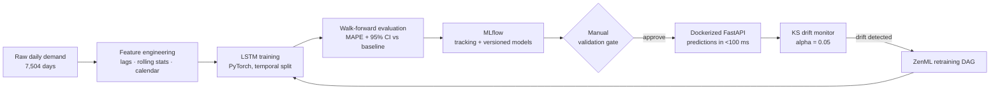

# Demand Forecasting Pipeline

An end-to-end machine learning system that forecasts daily product demand — not just a model, but the **full ML lifecycle**: data → features → LSTM training → honest evaluation → drift monitoring → automated retraining → a production API.

**Stack:** Python · PyTorch (LSTM) · MLflow · ZenML (optional) · FastAPI · Docker · AWS EC2

> 📚 **New to ML or time series?** Read [docs/CONCEPTS.md](docs/CONCEPTS.md) first — it explains every concept in this project (LSTM, MAPE, look-ahead bias, drift, MLflow…) from absolute zero.
>
> 🎤 **Preparing to present this project?** [docs/INTERVIEW_GUIDE.md](docs/INTERVIEW_GUIDE.md) justifies every metric and answers the questions interviewers actually ask.

---

## What this project does

Given ~20 years (7,504 days) of daily demand history, the system:

1. **Forecasts tomorrow's demand** with an LSTM neural network that reads the last 60 days of engineered features.
2. **Proves its accuracy honestly** — strict temporal splits (no look-ahead bias), walk-forward cross-validation, and a 95% confidence interval on the error, benchmarked against a seasonal-naive baseline.
3. **Notices when the world changes** — a Kolmogorov–Smirnov test (α = 0.05) compares recent demand against the same period last year and raises a drift alarm when the distribution genuinely shifts.
4. **Retrains itself safely** — a drift alarm triggers the retraining pipeline, but the new model waits at a **manual validation gate**: a human confirms the drift was real before the candidate replaces production.
5. **Serves predictions in production** — a Dockerized FastAPI keeps the model in memory and answers in well under 100 ms.

## Architecture



## Results

Measured by 5-fold walk-forward evaluation — every fold trains only on the past and is tested on the following unseen year (see [Honest evaluation](#the-three-ideas-this-project-is-really-about) below):

| Model | MAPE (mean of 5 folds) | 95% CI |
|---|---|---|
| Seasonal-naive baseline ("same day last week") | 14.27% | ± 0.58 |
| **LSTM (this project)** | **9.71%** | ± 0.42 |

**≈ 32% relative error reduction** over the baseline, and the confidence intervals don't overlap — the improvement isn't a lucky split. Numbers are written to `artifacts/evaluation_report.json` on every run; regenerate them yourself with one command below. (The dataset carries ~11% irreducible noise, so ~9% MAPE is close to the theoretical best — see [src/data/generate_data.py](src/data/generate_data.py).)

The drift detector also does its job: the generator injects a deliberate +18% demand shift in the final 60 days, and the KS test flags it at p ≈ 3×10⁻⁴ while staying quiet on calm data (proved by a test).

## Quickstart

```bash
# 1. Install dependencies (Python 3.11+)
pip install -r requirements.txt

# 2. Run the whole pipeline: data -> train -> evaluate -> drift check
python run_pipeline.py            # full run, a few minutes on CPU
python run_pipeline.py --quick    # ~1 minute smoke-test version

# 3. Inspect training runs in the MLflow UI
mlflow ui                         # -> http://localhost:5000

# 4. Serve predictions
uvicorn src.api.main:app --reload # -> http://127.0.0.1:8000/docs
```

Try the API (the `/docs` page gives you an interactive playground):

```bash
curl -X POST http://127.0.0.1:8000/predict \
  -H "Content-Type: application/json" -d '{"days": 7}'

curl http://127.0.0.1:8000/drift        # run the KS drift check
curl http://127.0.0.1:8000/model/info   # which model is serving
```

Run the tests (each one guards a claim the project makes — leakage-freedom, split ordering, drift detection):

```bash
python -m pytest tests/ -v
```

Docker:

```bash
docker build -t demand-forecast-api .
docker run -p 8000:8000 demand-forecast-api
```

## Project structure

```
├── run_pipeline.py            # one command runs everything, in order
├── src/
│   ├── config.py              # every "magic number", explained in one place
│   ├── data/generate_data.py  # 7,504 days of synthetic demand (+ a deliberate
│   │                          #   distribution shift for the drift detector)
│   ├── features/build_features.py  # lags, rolling stats, calendar — leak-free
│   ├── models/lstm_model.py   # the LSTM + sequence windowing
│   ├── training/train.py      # temporal split, early stopping, MLflow logging
│   ├── evaluation/evaluate.py # walk-forward CV, baseline, 95% CI
│   ├── monitoring/drift.py    # Kolmogorov–Smirnov drift detection
│   └── api/main.py            # FastAPI serving layer
├── pipelines/zenml_pipeline.py  # the same flow as a ZenML DAG (optional)
├── tests/test_pipeline.py     # tests that guard the honesty of the metrics
├── docs/                      # beginner concepts guide + interview guide
└── Dockerfile
```

## The three ideas this project is really about

The LSTM is the *least* interesting part — any tutorial covers that. The engineering value is in three disciplines around it:

**1. Evaluation that can't lie to you.**
Time-series data must never be split randomly: a model tested on Monday but trained on the following Tuesday has effectively seen the answer (adjacent days are correlated). This is *look-ahead bias*, and it makes test scores look great while production fails. Here, every split is chronological, every feature uses only the past (enforced by a test!), normalization statistics are computed on training data only, and the headline number comes from walk-forward evaluation — 5 simulations of "train on the past, forecast the future" — with a confidence interval, not one lucky split.

**2. Monitoring that knows its own false-alarm rate.**
The KS drift test at α = 0.05 has a 5% false-positive rate *per test, by design* — over months of monitoring, false alarms are a statistical certainty. That's why drift triggers a **candidate** retrain that waits at a manual gate, never an automatic deployment. (There's also a subtle trap this project ran into and solved: on seasonal data, naively comparing "this month vs last month" flags ordinary seasonality as drift — the detector compares year-over-year instead. See [src/monitoring/drift.py](src/monitoring/drift.py).)

**3. Serving with full lineage.**
Every trained model is logged to MLflow with its parameters, metrics, and data window. The API exposes which model version is serving. Any prediction can be traced back to the exact training run that produced it — and rolling back is a version switch, not a scramble.

## Deployment notes (AWS)

The API is designed for a small EC2 deployment: the Docker image runs on 1–2 `t3.small` nodes behind an Application Load Balancer with an Auto Scaling Group (min 1, max 2). At ~1,000 predictions/day, the second node exists for **availability and bursts**, not average throughput — traffic clusters in morning planning windows. Scaling to one node off-peak keeps cost near single-instance level. Latency stays under 100 ms because the model loads into memory once at container startup — a request is just JSON parsing, feature assembly, and a single LSTM forward pass (a few milliseconds on CPU).

## Roadmap / honest limitations

- **Probabilistic forecasts** — quantile (pinball) loss so downstream planning gets uncertainty bands, not just point estimates.
- **Champion/challenger automation** — auto-compare candidate vs incumbent on recent data, keeping the human only for final promotion.
- **Gradient-boosting benchmark** — trees on lag features are a brutally strong baseline for tabular demand (see the M5 competition); quantifying what the LSTM actually buys is the right next experiment.
- **CI-interval rigor** — walk-forward folds share history, so the t-based interval is approximate; a blocked bootstrap would be tighter.
- Synthetic data — realistic (trend, dual seasonality, holidays, promos, noise, regime shift) but generated; the pipeline is dataset-agnostic and any daily series with a `date,demand` CSV drops straight in.

## License

MIT
